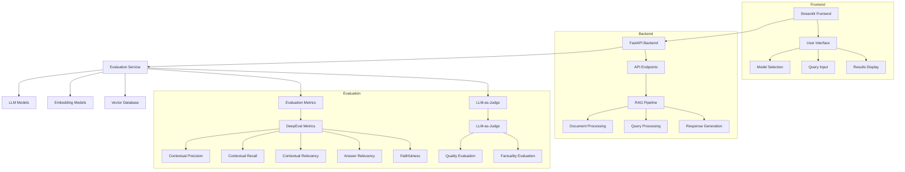

# GraphFraudEval

A comprehensive framework for evaluating and analyzing fraud detection systems using GraphRAG (Graph-based Retrieval Augmented Generation) and LLM evaluation. This framework combines advanced graph-based fraud detection with sophisticated LLM evaluation metrics to provide robust fraud analysis and detection capabilities.

## Architecture



## Features

- Advanced fraud detection using GraphRAG
- Compare different LLM models (e.g., GPT-3.5, GPT-4, Claude)
- Evaluate various embedding models (e.g., OpenAI, Sentence Transformers)
- Test RAG pipeline performance
- Measure key metrics:
  - Response accuracy
  - Latency
  - Cost per query
  - Relevance scores
  - Context retrieval quality
- LLM-as-judge evaluation:
  - Quality assessment (accuracy, completeness, clarity, relevance)
  - Factuality checking (factual accuracy, hallucination level, source attribution)
- Interactive visualization of results
- Document management and processing

## Project Structure

```
graphfraudeval/
├── frontend/
│   ├── app.py
│   ├── components/
│   └── utils/
├── backend/
│   ├── main.py
│   ├── api/
│   ├── services/
│   ├── models/
│   └── utils/
├── data/
│   ├── documents/
│   └── test_queries/
├── tests/
├── requirements.txt
└── README.md
```

## Setup

1. Clone the repository
2. Create a virtual environment:
   ```bash
   python -m venv venv
   source venv/bin/activate  # On Windows: venv\Scripts\activate
   ```
3. Install dependencies:
   ```bash
   pip install -r requirements.txt
   ```
4. Set up environment variables:
   ```bash
   cp .env.example .env
   # Edit .env with your API keys and configurations
   ```
5. Run the application:
   ```bash
   # Start backend
   uvicorn backend.main:app --reload
   
   # Start frontend (in a new terminal)
   streamlit run frontend/app.py
   ```

## Usage

1. Access the web interface at `http://localhost:8501`
2. Select models to evaluate
3. Upload test documents or use sample data
4. Submit queries for evaluation
5. View comprehensive results and metrics:
   - DeepEval metrics for RAG evaluation
   - LLM-as-judge quality and factuality scores
   - Performance metrics and cost analysis

## Contributing

Contributions are welcome! Please feel free to submit a Pull Request.

## License

This project is licensed under the MIT License - see the LICENSE file for details. 